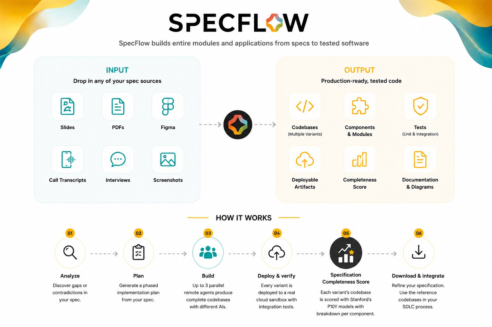
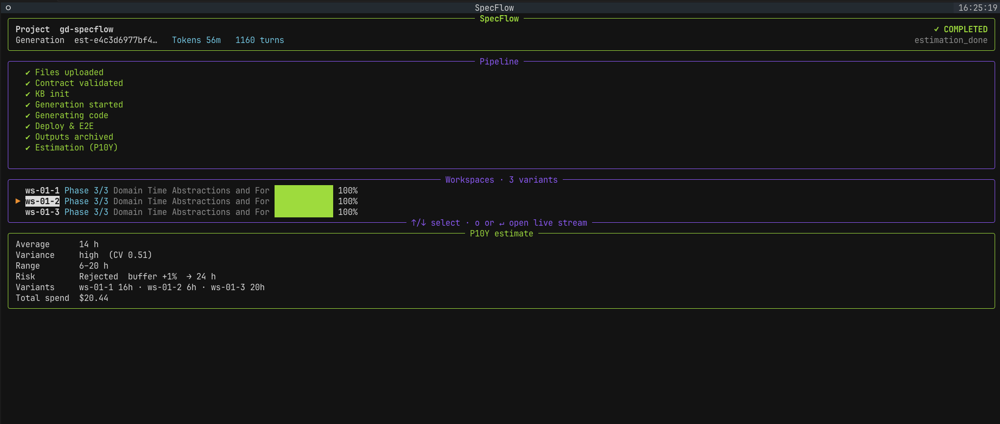

<div align="center">


### Agentic Harness for Large-Scale Code Generation

[](LICENSE)
[](https://pypi.org/project/gd-specflow/)
[](https://www.python.org/downloads/)
[](https://github.com/griddynamics/specflow/actions/workflows/publish-mcp.yml)

</div>

---
AI agent harness for automated code generation and complexity estimation.
Multiple deployable codebases built by multiple SOTA AI models.
When their code complexity scores align, it proves the specs are complete.

SpecFlow is an AI agent harness that automates code generation, deployment, and testing through parallel AI agents in isolated, sandboxed execution environments.

Validator agents continuously assess, resume, and refine work until delivery standards are met.





[https://github.com/user-attachments/assets/0783c394-1bf0-449f-a36e-1d46e899661c](https://github.com/user-attachments/assets/0783c394-1bf0-449f-a36e-1d46e899661c)


<!-- GETTING STARTED -->
## Getting Started


### Software


| Requirement | Notes                                                                                                        |
| ----------- | ------------------------------------------------------------------------------------------------------------ |
| Docker      | Container runtime for the harness sandbox. [Install Docker](https://docs.docker.com/get-started/get-docker/) |
| `uv`        | Python package manager. Install via `brew install uv` or [see docs](https://github.com/astral-sh/uv)         |
| IDE         | SpecFlow is used as MCP in a IDE with agentic AI enabled: Cursor, Claude Code, Copilot, Gemini etc. This is the users project.         |


### Keys and Tokens


| Key                          | Name in `.env`                              | Notes                                                                                                                                            |
| ---------------------------- | ------------------------------------------- | ------------------------------------------------------------------------------------------------------------------------------------------------ |
| GitHub Personal Access Token | `GITHUB_TOKEN`                              | For disposable workspace repos. Scope: `repo` + `read:user` + `workflow` `repo,read:user`. Advan                           |
| P10Y API key                 | `P10Y_API_KEY`                              | Code complexity scoring. [Setup guide](docs/quickstart-compass.md)                                                                               |
| LLM provider key             | `OPENROUTER_API_KEY` or `ANTHROPIC_API_KEY` | One key required. [Get OpenRouter key](https://openrouter.ai/keys) (default) or [Get Anthropic key](https://console.anthropic.com/settings/keys) |


### Installation

Few simple steps to get you going:

- clone repo
  ```sh
  git clone https://github.com/griddynamics/specflow.git && cd specflow
  ```
- install Specflow TUI (Terminal UI) to guide you through onboarding
  ```sh
  uv tool install --editable "./mcp_server[tui]"
  ```
- start Specflow app and follow instructions
  ```
  specflow tui
  ```


> [!Important]
> Specflow Harness Sandbox is now running locally. 
> Access it via MCP in your favourite Agentic client: copy-paste the content of `.specflow-local/mcp-config.json`.


<table>
  <tr>
    <td align="center"><br><b>Cursor</b></td>
    <td align="center"><br><b>Claude Code</b></td>
    <td align="center"><br><b>Claude Desktop</b></td>
    <td align="center"><br><b>Copilot</b></td>
    <td align="center"><br><b>Gemini CLI</b></td>
  </tr>
</table>

...and any other IDE or client that supports the [Model Context Protocol](https://modelcontextprotocol.io).


<!-- USAGE -->
## Usage

MCP is now ready to use in any project. Prompt your IDE agent to talk to the harness.

Let's say specification files are in `specs` directory, you can follow these steps:

1. Start a new project in IDE and put your specs files into `specs` directory
   ```text
   specs/
   |-- product-requirements.md
   |-- user-flows.pdf
   \-- acceptance-criteria.md
   ```
2. Check your specification completeness using `check_specification_completeness`  tool

   ```text
   Use SpecFlow MCP to check specification completeness in specs directory
   ```

3. Create a detailed plan using our `run_planning` tool

   ```text
   Create implementation plan using SpecFlow MCP
   ```

4. When you are happy with the plan, run generation using `run_generation` as above
   ```text
   Run generation with SpecFlow MCP
   ```

5. Generation usually takes many hours, use our TUI to monitor progress and receive Desktop Notifications:

   ```sh
   # Any terminal
   specflow tui
   ```




6. When the generation has been completed, you can retrieve the results and P10Y reports from harness:
   ```text
   Download outputs using Specflow MCP
   ```
   **The rule of thumb is: if the P10Y score spread is low, then your specification is ready!**

7. Use the built-in prompt to compare the variants and identify their strong and weak sides, together with a plan to automatically assemble the best variant.
   ```text
   use SpecFlow MCP prompt: specflow-compare-variants
   ```


### MCP Tools


| Tool                               | Description                                                 |
| ---------------------------------- | ----------------------------------------------------------- |
| `check_specification_completeness` | Analyze specs for gaps and contradictions (local)           |
| `run_planning`                     | Generate a phased implementation plan (local)               |
| `read_document`                    | Extract PDF/DOCX/PPTX/XLSX/CSV to markdown (local)          |
| `run_generation`                   | Upload and launch parallel codegen on the backend (2-8 hrs) |
| `check_status`                     | Poll generation progress                                    |
| `download_outputs`                 | Download archived artifacts from a completed run            |
| `retry_generation`                 | Retry a failed generation                                   |


<!-- IF YOU WANT TO GO DEEPER -->
## If you want to go deeper


### SpecFlow Detailed Overview

[https://github.com/user-attachments/assets/ea1dd95d-5742-4c51-bf2c-c2cb582669c3](https://github.com/user-attachments/assets/ea1dd95d-5742-4c51-bf2c-c2cb582669c3)


Full MCP config and usage: **[MCP_USER.md](MCP_USER.md)**


Full MCP API reference: **[docs/mcp/API_REFERENCE.md](docs/mcp/API_REFERENCE.md)**


Detailed SpecFlow harness instructions: [QUICKSTART.md](docs/QUICKSTART.md)


> [!Important]
> AI agents work in **scratchpad repos** that are reset before each run — we create them for you. 
> **Do not point SpecFlow at repositories with code or history you want to keep.
> ** The managed SpecFlow service is for Grid Dynamics employees only. Open-source users should run the local quickstart.


### Documentation


| Document                                                                 | Description                                 |
| ------------------------------------------------------------------------ | ------------------------------------------- |
| [QUICKSTART.md](docs/QUICKSTART.md)                                      | Local setup and first run                   |
| [CLAUDE.md](CLAUDE.md)                                                   | Development protocol and STEEL commandments |
| [docs/ARCHITECTURE.md](docs/ARCHITECTURE.md)                             | System design and data flow                 |
| [docs/mcp/API_REFERENCE.md](docs/mcp/API_REFERENCE.md)                   | MCP tool reference                          |
| [docs/backend/DEVELOPMENT.md](docs/backend/DEVELOPMENT.md)               | Backend development guide                   |
| [docs/backend/API_REFERENCE.md](docs/backend/API_REFERENCE.md)           | REST API reference                          |
| [docs/operations/TROUBLESHOOTING.md](docs/operations/TROUBLESHOOTING.md) | Troubleshooting guide                       |
| [docs/IDE-SETUP.md](docs/IDE-SETUP.md)                                   | IDE configuration (Cursor + Claude Code)    |


<!-- LICENSE -->
## License

[MIT](LICENSE) — Copyright (c) 2024 Grid Dynamics International, Inc.


<p align="right">(<a href="#readme-top">back to top</a>)</p>
