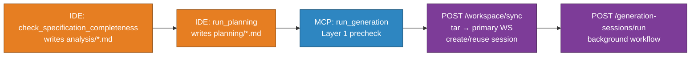
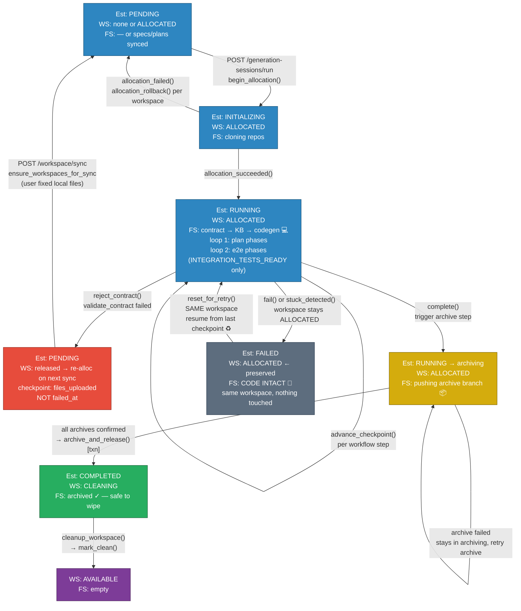
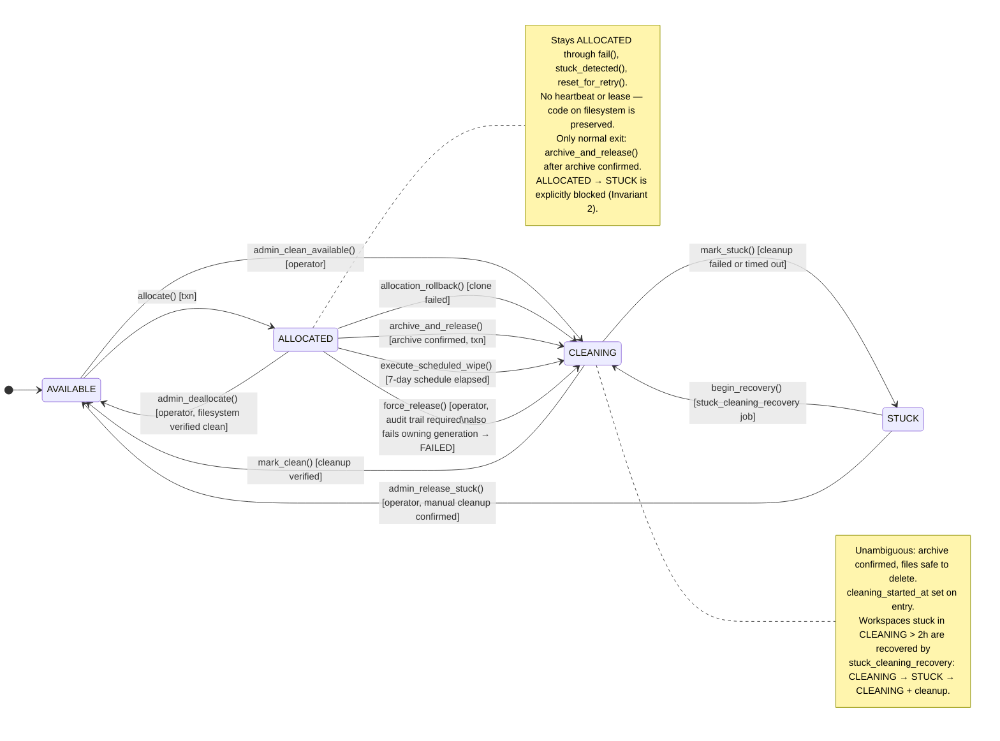
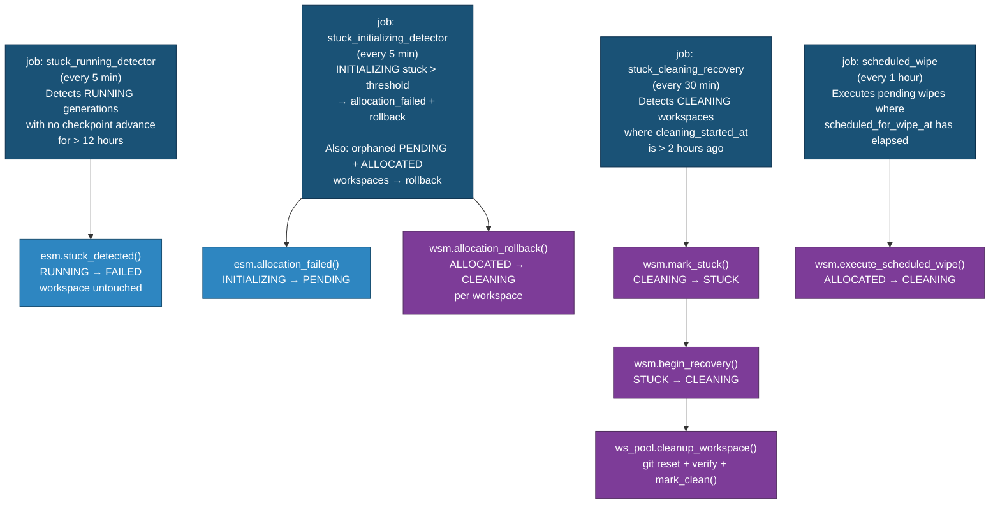
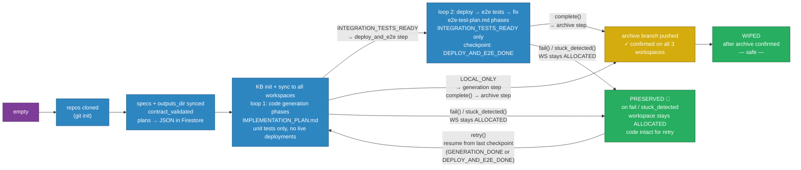

# State Transition Diagrams

Each diagram combines three dimensions into one view:
- **Generation status** — what the generation record says
- **Workspace status** — what the workspace record says
- **Filesystem state** — what is actually on the persistent volume

The interaction between these three is where data loss has historically occurred.
All diagrams reflect the current production state of the system.

**PR255 (local analysis/planning):** Spec completeness and implementation planning run in the
user's IDE (MCP tools `check_specification_completeness`, `run_planning`). The backend is not involved
until `run_generation`. There is no `GenerationStatus.ANALYSIS` and no `begin_analysis()` transition.

---

## 0 — User journey vs backend (PR255)

| Step | Session status | Workspaces |
|------|----------------|------------|
| After `create()` or first sync | `pending` | Allocated on first sync (or reused if still `ALLOCATED` + `locked_by` match) |
| `generation-sessions/run` starts | `pending` → `initializing` → `running` | Stay allocated |
| Contract validator rejects | `running` → `pending` via `reject_contract()` | Released (`workspace_ids` cleared); next sync re-allocates |
| Real workflow failure | → `failed` | **Stay allocated** (Commandment II) |

**`/workspace/sync` reuse rules (same `generation_id`):**
- Allowed only while generation status is **`pending`** (e.g. after contract reject, or before first `/run`).
- Rejected with **409** if status is `running`, `failed`, `completed`, or `initializing`.
- `ensure_workspaces_for_sync`: reuse workspaces still `ALLOCATED` and `locked_by` this session; otherwise allocate a fresh set (no workspace theft).

---

## 1 — Generation Lifecycle

`fail()` and `stuck_detected()` do not release the workspace. Filesystem is only wiped
after a confirmed archive to a dedicated branch. Retry always resumes on the same workspace.

Checkpoints while `RUNNING` (strictly forward): `files_uploaded` → `contract_validated` →
`kb_init_done` → `generation_started` → `generation_done` → `deploy_and_e2e_done`* →
`outputs_archived` → `estimation_done` (*skipped on `LOCAL_ONLY`).

**Key invariants:**
1. `fail()` and `stuck_detected()` **never** release a workspace — code on the filesystem is preserved
2. The only normal exit from ALLOCATED is `archive_and_release()`, called exclusively from `complete()` after archive is confirmed across all workspaces
3. Retry (`reset_for_retry` from `FAILED`) reuses the exact same workspace IDs if `code_archived == False`
4. `complete()` raises if either `outputs_archived != True` or archive branch is missing from any workspace repo
5. **`reject_contract()`** is not `fail()` — no `failed_at`; session returns to `PENDING`, workspaces released, checkpoint reset to `files_uploaded` so the validator cannot be skipped on retry
6. Local spec/planning does not create a generation session — first backend touch is `run_generation` → `/workspace/sync`

---

## 2 — Workspace States

Normal lifecycle paths are solid. Operator escape hatches are dashed.

---

## 3 — Background Jobs

Each job is scoped strictly. No background job may read from, write to,
or transition an ALLOCATED workspace (Commandment VI).

---

## 4 — Filesystem State

---

## 5 — Cross-System Trigger Map

| Event | Generation → | Workspace → | Filesystem → |
|---|---|---|---|
| `create()` | → PENDING | no workspace yet | — |
| `POST /workspace/sync` (new session) | → PENDING (if new) | AVAILABLE → ALLOCATED (set) | tar extracted to primary WS |
| `POST /workspace/sync` (reuse `generation_id`) | must be PENDING | reuse ALLOCATED+locked or fresh allocate | tar overwrites primary WS |
| `begin_allocation()` | PENDING → INITIALIZING | already ALLOCATED from sync | — |
| `allocation_failed()` | INITIALIZING → PENDING | ALLOCATED → CLEANING | → cleanup |
| `allocation_succeeded()` | INITIALIZING → RUNNING | stays ALLOCATED | → workflow steps |
| `reject_contract()` | RUNNING → PENDING; checkpoint → `files_uploaded`; `workspace_ids` cleared | ALLOCATED → CLEANING (rollback per WS) | user fixes files locally; not a failure |
| `advance_checkpoint()` — contract / KB | RUNNING (→ `contract_validated`, `kb_init_done`) | no change | plans normalized + JSON stored |
| `advance_checkpoint()` — generation steps | RUNNING (→ `generation_done`) | no change | loop 1 code being written |
| `advance_checkpoint()` — deploy_and_e2e | RUNNING (→ `deploy_and_e2e_done`) | no change | loop 2 *(INTEGRATION_TESTS_READY only)* |
| `advance_checkpoint()` — archive / P10Y | RUNNING (→ `outputs_archived`, `estimation_done`) | no change | reports / archives |
| `fail()` | PENDING / INITIALIZING / RUNNING → FAILED | **stays ALLOCATED** ✓ | **preserved** ✓ |
| `stuck_detected()` | RUNNING → FAILED | **stays ALLOCATED** ✓ | **preserved** ✓ |
| `reset_for_retry()` | FAILED → PENDING | **same ALLOCATED** ✓ | **resumes** ✓ |
| `complete()` archive step | RUNNING → archiving | stays ALLOCATED | → archive branch pushed |
| `archive_and_release()` | RUNNING → COMPLETED | **ALLOCATED → CLEANING** ✓ | archive confirmed |
| `mark_clean()` | stays COMPLETED | CLEANING → AVAILABLE | → wiped |
| `mark_stuck()` | — | CLEANING → STUCK | — |
| `begin_recovery()` | — | STUCK → CLEANING | — |
| `cleanup_workspace()` | — | CLEANING → AVAILABLE (via `mark_clean`) | → git reset → empty |
| `schedule_wipe()` | — | ALLOCATED (flag set, no status change) | — |
| `execute_scheduled_wipe()` | — | ALLOCATED → CLEANING | — |
| `force_release()` *(operator)* | **RUNNING/INITIALIZING/PENDING → FAILED** (if locked_by set) | ALLOCATED → CLEANING | — |
| `admin_clean_available()` *(operator)* | — | AVAILABLE → CLEANING | — |
| `admin_deallocate()` *(operator)* | — | ALLOCATED → AVAILABLE *(filesystem clean check required)* | — |
| `admin_release_stuck()` *(operator)* | — | STUCK → AVAILABLE | — |

---

## 6 — Transition Authority

All state writes are funnelled through two state machines in `backend/app/state/`.
Nothing outside `state/` may write `status`, `checkpoint`, or `workspace_phases` to Firestore.
The CI guard (`ci/check_state_writes.sh`) enforces this on every commit.

| State machine | File | Owns |
|---|---|---|
| `GenerationStateMachine` | `state/generation_state_machine.py` | `status`, `checkpoint`, `workspace_phases` on generation docs |
| `WorkspaceStateMachine` | `state/workspace_state_machine.py` | `status`, `locked_by`, `last_used_by`, `cleaning_started_at` on workspace docs |

`triggered_by` values use constants from `TriggeredBy` in `state/transitions.py`:
- `api:*` — API / service layer calls
- `orchestrator:*` — workflow orchestrator steps
- `job:*` — background job detectors
- `admin:*` — operator escape hatches
